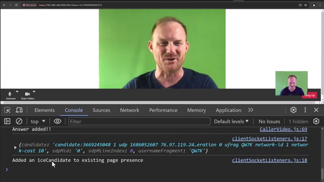

# [React with WebRTC in 80min - video chat app with React](https://www.youtube.com/watch?v=jIi_QuizfnQ)

[0:00](https://www.youtube.com/watch?v=jIi_QuizfnQ) - [1. Whiteboard Project](#1-whiteboard-project)  
[3:02](https://www.youtube.com/watch?v=jIi_QuizfnQ&t=182s) - [2. Issues when putting these 2 together](#2-issues-when-putting-these-2-together)  
[8:13](https://www.youtube.com/watch?v=jIi_QuizfnQ&t=493s) - [3. Demo](#3-demo)  
[10:04](https://www.youtube.com/watch?v=jIi_QuizfnQ&t=604s) - [4. Project setup & resources](#4-project-setup-and-resources)  
[13:27](https://www.youtube.com/watch?v=jIi_QuizfnQ&t=807s) - [5. Backend overview and test connection](#5-backend-overview-and-test-connection)  
[17:32](https://www.youtube.com/watch?v=jIi_QuizfnQ&t=1052s) - [6. Handling potential errors (IMPORTANT!)](#6-handling-potential-errors-important)  
[19:21](https://www.youtube.com/watch?v=jIi_QuizfnQ&t=1161s) - [7. Front-end code overview](#7-front-end-code-overview)  
[24:22](https://www.youtube.com/watch?v=jIi_QuizfnQ&t=1462s) - [8. socketConnection and socket events](#8-socketconnection-and-socket-events)  
[28:02](https://www.youtube.com/watch?v=jIi_QuizfnQ&t=1682s) - [9.Call and offer](#9-call-and-offer)  
[54:14](https://www.youtube.com/watch?v=jIi_QuizfnQ&t=3254s) - [10. Enable and disable video](#10-enable-and-disable-video)  
[70:26](https://www.youtube.com/watch?v=jIi_QuizfnQ&t=4226s) - [11. Answer](#11-answer)  
[81:30](https://www.youtube.com/watch?v=jIi_QuizfnQ&t=4890s) - [12. Hangup button](#12-hangup-button)  

## 1. Whiteboard Project  


## 2. Issues when putting these 2 together
- let webrtc drive (as it is async) and do its thing then hand it to react 

## 3. Demo




## 4. Project setup and resources
- [https://www.youtube.com/watch?v=jIi_QuizfnQ](https://www.youtube.com/watch?v=jIi_QuizfnQ)
- [https://github.com/robertbunch/webrtc-react-starter](https://github.com/robertbunch/webrtc-react-starter)
- connecting from frontend requires https (WebRTC Media requires https)
- backend is http

### create react app (https in development)
- NOTE: REQUIRED STEP!
- [https in development](https://create-react-app.dev/docs/using-https-in-development/#custom-ssl-certificate)
- package.json 
    - `"start": "cross-env HTTPS=true SSL_CRT_FILE=./certs/cert.crt SSL_KEY_FILE=./certs/cert.key react-scripts start"`
    - note that im using `cross-env` npm module for crossplatform env variable and i am also using my certs... 

## 5. Backend overview and test connection  

### test the connection:
- 16min40sec 
- front-end/src/Components/Home.js
- uncomment
- NOTE: after test, recomment else it will mess with the backend
- OUTCOME: browser console logs `pong`
- TROUBLESHOOT: the version of frontend package and backend package should be same 
    - eg. backend "socket.io": "^4.7.5"
    - eg. frontend "socket.io-client": "^4.7.5"

```js
//front-end/src/Components/Home.js
useEffect(()=>{
    const test = async()=>{
        const socket = socketConnection("test")
    }
    //if this works, you will get pong in the console!
    test()
},[])
```
## 6. Handling potential errors (IMPORTANT!)
- @17min32sec 
- restart server
- restart browser/page

## 7. Front-end code overview  
- @19min21sec
- TODO: move app state (which in tutorial is being passed down to each component) into react context
- App State (tutorial):
    - callStatus
    - localStream
    - remoteStream
    - peerConnection
    - username
    - offerData


## 8. socketConnection and socket events  
## 9. Call and offer  
## 10. Enable and disable video  
## 11. Answer  
## 12. Hangup button  